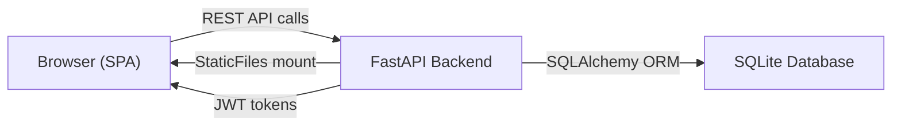

# Employee Management System (EMS) — Complete Project Overview

> **Repository:** [https://github.com/ke961/Employee-Workforce-System](https://github.com/ke961/Employee-Workforce-System)
> **Stack:** FastAPI (Python) + Vanilla HTML/CSS/JS SPA · SQLite · JWT Auth

---

## 🏗️ Architecture

The project is a **full-stack Single-Page Application (SPA)** with a Python FastAPI backend serving a vanilla JavaScript frontend. The backend provides RESTful API endpoints, handles JWT authentication, and manages a SQLite database. The frontend is served as static files directly by the FastAPI server.



### Directory Structure

```
Employee-Workforce-System/
├── .gitignore
├── README.md
├── backend/
│   ├── app.py                 # Main FastAPI app, startup seeding, static file serving
│   ├── database.py            # SQLAlchemy engine, session factory, Base
│   ├── dependencies.py        # get_db() and get_current_admin() dependencies
│   ├── models.py              # 9 SQLAlchemy ORM models (~1120 lines)
│   ├── schemas.py             # Pydantic request/response schemas
│   ├── requirements.txt       # Python dependencies
│   └── routers/
│       ├── announcements.py   # Company announcements CRUD
│       ├── attendance.py      # Clock in/out & attendance history
│       ├── auth.py            # Registration, login, logout, JWT refresh, profile
│       ├── dashboard.py       # Aggregated dashboard summary
│       ├── expenses.py        # Expense claims management
│       ├── leave.py           # Leave requests & balance
│       ├── okrs.py            # Objectives & Key Results with Key Results
│       ├── onboarding.py      # Onboarding task management
│       └── tasks.py           # Tasks & Projects management
└── frontend/
    ├── index.html             # Full SPA markup (~640 lines)
    ├── css/
    │   └── styles.css         # Design system & all component styles (~1015 lines)
    └── js/
        └── script.js          # All application logic (~2470 lines)
```

---

## 🔐 Authentication & Authorization

### JWT Token System
| Setting | Value |
|---------|-------|
| Algorithm | HS256 |
| Access Token Expiry | 120 minutes |
| Refresh Token Expiry | 7 days |
| Storage | `localStorage` (`ems_access_token`, `ems_refresh_token`, `ems_admin_data`) |

### Auth Flow
1. User logs in with email + password → backend returns `access_token` + `refresh_token`
2. All API calls include `Authorization: Bearer <access_token>` header
3. On 401, frontend automatically attempts token refresh via `/api/auth/refresh`
4. On logout, refresh token is cleared server-side and all local storage is wiped

### Default User Accounts (Seeded on Startup)

| Role | Full Name | Email | Password |
|------|-----------|-------|----------|
| Admin | System Administrator | `admin@ems.local` | `Admin123!` |
| Admin | System Administrator | `admin@gmail.com` | `Admin123` |
| Manager | HR Manager | `manager@gmail.com` | `Manager123` |
| Employee | Employee User | `employee@gmail.com` | `Employee123` |
| Admin | Senior Developer | `senior.dev@gmail.com` | `SeniorDev123` |
| Admin | HR Operations Specialist | `hr.operations@gmail.com` | `HROps123` |
| Admin | HR Operations Specialist 2 | `hr.operations2@gmail.com` | `HROps456` |

### Auth API Endpoints

| Method | Endpoint | Description |
|--------|----------|-------------|
| `POST` | `/api/auth/register` | Register a new admin user |
| `POST` | `/api/auth/login` | Login, returns JWT access + refresh tokens |
| `POST` | `/api/auth/logout` | Logout (clears refresh token) |
| `POST` | `/api/auth/refresh` | Refresh access token |
| `GET` | `/api/auth/me` | Get current user profile |
| `PATCH` | `/api/auth/me` | Update profile (name, job title, department, phone) |
| `PATCH` | `/api/auth/change-password` | Change password (requires current password) |

---

## 📊 Module 1: Dashboard

The landing page after login, featuring a personalized welcome hero, a prominent **Clock In/Clock Out Workstation**, real-time attendance records, and 6 summary stat cards.

### Dashboard Stat Cards
| Card | Data Source |
|------|------------|
| Attendance Status | `/api/attendance/status` — clock-in state + minutes worked |
| Leave Balance | `/api/dashboard` — available days out of 20 + pending requests |
| Onboarding Progress | `/api/dashboard` — completed/total tasks + percentage |
| OKR Progress | `/api/dashboard` — average progress + active OKR count |
| Active Tasks | `/api/tasks` — count of non-completed tasks |
| Expense Claims | `/api/expenses` — pending claim total + count |

### Dashboard API

| Method | Endpoint | Description |
|--------|----------|-------------|
| `GET` | `/api/dashboard` | Returns aggregated profile, attendance, leave, onboarding, OKR data |

---

## 🕒 Module 2: Clock In / Clock Out Workstation

The **primary focal feature** on the landing page — a premium time-tracking station.

### Landing Page Workstation Components
- **Live Digital Clock** — Real-time ticking clock (12-hour format, updates every second)
- **Date Display** — Full weekday + date string
- **Status Chip** — Animated pulsing green dot when clocked in (`CLOCKED IN & WORKING`), red when not (`NOT CLOCKED IN`)
- **Active Shift Duration Timer** — Live `HH:MM:SS` counter ticking while clocked in
- **Large Action Buttons** — Emerald green gradient `CLOCK IN` (▶) and rose pink gradient `CLOCK OUT` (⏹)
- **Shift Metrics Footer** — Clock-in time, clock-out time, total shift duration
- **Embedded Attendance Log Table** — Today's 5 most recent shift records with live status

### Attendance API Endpoints

| Method | Endpoint | Description |
|--------|----------|-------------|
| `GET` | `/api/attendance` | List all attendance records (ordered by date desc) |
| `GET` | `/api/attendance/status` | Current clock-in status (is_clocked_in, today's record) |
| `POST` | `/api/attendance/clock-in` | Clock in for today |
| `PATCH` | `/api/attendance/clock-out` | Clock out (auto-calculates total_work_minutes) |

### Attendance Database Model

| Field | Type | Description |
|-------|------|-------------|
| `id` | Integer | Primary key |
| `admin_id` | FK → Admin | Owner |
| `attendance_date` | Date | Default: today |
| `clock_in` | DateTime | Nullable |
| `clock_out` | DateTime | Nullable |
| `total_work_minutes` | Integer | Auto-calculated on clock-out |
| `status` | String | "present", "absent", "late" |

---

## 📋 Module 3: Leave Management

Full leave request lifecycle — submit, track balance, approve/reject, cancel.

### Features
- **Leave Request Form** — Type (Annual, Sick, Personal, Emergency, Other), date range, reason
- **Leave Balance Card** — Shows available/used/pending days (total allowance: 20 days/year)
- **Leave History Table** — All requests with type, dates, duration, status badges, cancel action

### Leave API Endpoints

| Method | Endpoint | Description |
|--------|----------|-------------|
| `GET` | `/api/leave` | List all leave requests |
| `GET` | `/api/leave/balance` | Get leave balance (total: 20, used, pending, available) |
| `POST` | `/api/leave` | Submit new leave request |
| `PATCH` | `/api/leave/{id}/status` | Approve or reject a request |
| `DELETE` | `/api/leave/{id}` | Cancel/delete a request |

### Leave Database Model

| Field | Type | Description |
|-------|------|-------------|
| `leave_type` | String | Annual, Sick, Personal, Emergency, Other |
| `start_date` / `end_date` | Date | Leave period |
| `reason` | Text | Optional reason |
| `status` | String | "pending", "approved", "rejected" |
| `total_days` | Integer | Calculated duration |

---

## ✅ Module 4: Employee Onboarding

Guided onboarding checklist with progress tracking.

### Features
- **Progress Bar** — Visual completion percentage
- **Task List** — Ordered onboarding steps with mark complete / reset buttons
- **Default Seed Tasks** (6 tasks created per user on first login):
  1. Complete Personal Information Form
  2. Review Company Policies & Handbook
  3. Set Up Workstation & Tools
  4. Complete IT Security Training
  5. Meet Your Team Members
  6. First Week Goals & Expectations

### Onboarding API Endpoints

| Method | Endpoint | Description |
|--------|----------|-------------|
| `GET` | `/api/onboarding` | List all onboarding tasks |
| `GET` | `/api/onboarding/progress` | Get progress (completed, total, percentage) |
| `POST` | `/api/onboarding` | Create a new task |
| `PATCH` | `/api/onboarding/{id}` | Mark complete or reset |
| `DELETE` | `/api/onboarding/{id}` | Delete a task |

---

## 🎯 Module 5: Objectives & Key Results (OKRs)

Full OKR management with nested key results and progress tracking.

### Features
- **Create OKR Form** — Title + description
- **OKR Cards** — Progress bar (0–100%), progress slider, status badge
- **Key Results** — Nested items under each OKR with target/current values
- **Inline Add Key Result** — Add key results directly on each OKR card

### OKR API Endpoints

| Method | Endpoint | Description |
|--------|----------|-------------|
| `GET` | `/api/okrs` | List all OKRs with key results |
| `POST` | `/api/okrs` | Create a new OKR |
| `PATCH` | `/api/okrs/{id}` | Update progress/status |
| `DELETE` | `/api/okrs/{id}` | Delete an OKR |
| `POST` | `/api/okrs/{id}/key-results` | Add a key result |
| `PATCH` | `/api/okrs/{okr_id}/key-results/{kr_id}` | Update key result value |
| `DELETE` | `/api/okrs/{okr_id}/key-results/{kr_id}` | Delete a key result |

### OKR Database Models

**OKR:** `title`, `description`, `progress` (0-100), `status` (in_progress/completed)
**KeyResult:** `title`, `target_value`, `current_value` (linked to parent OKR)

---

## 📋 Module 6: Tasks & Projects

Kanban-style task management with priorities and status workflows.

### Features
- **Create Task Form** — Title, description, priority (Low/Medium/High/Urgent), due date
- **Filter Tabs** — All, To Do, In Progress, In Review, Completed
- **Task Cards** — Color-coded priority tags, status dropdown selector, delete action

### Tasks API Endpoints

| Method | Endpoint | Description |
|--------|----------|-------------|
| `GET` | `/api/tasks` | List all tasks (optional `?status=` filter) |
| `POST` | `/api/tasks` | Create a new task |
| `PATCH` | `/api/tasks/{id}` | Update task (status, title, description, etc.) |
| `DELETE` | `/api/tasks/{id}` | Delete a task |

### Task Database Model

| Field | Type | Description |
|-------|------|-------------|
| `title` | String | Task name |
| `description` | Text | Optional details |
| `priority` | String | "low", "medium", "high", "urgent" |
| `status` | String | "todo", "in_progress", "review", "completed" |
| `due_date` | Date | Optional deadline |

---

## 📢 Module 7: Company Announcements

Company-wide announcement publishing system with categories and pinning.

### Features
- **Publish Form** — Title, category (Urgent/General/Event/Policy Update), pin toggle, content
- **Announcement Feed** — Cards with category badges, pinned indicators, author, date, delete action
- **Ordering** — Pinned announcements always appear first, then by newest
- **Default Seed Announcements** (4 seeded on startup)

### Announcements API Endpoints

| Method | Endpoint | Description |
|--------|----------|-------------|
| `GET` | `/api/announcements` | List all (pinned first, then by date desc) |
| `POST` | `/api/announcements` | Create announcement |
| `DELETE` | `/api/announcements/{id}` | Delete announcement |

---

## 💳 Module 8: Payroll & Expense Reimbursements

Expense claim submission and approval workflow.

### Features
- **Submit Expense Form** — Category (Travel/Meals/Office Supplies/Software/Training/Other), amount, merchant, date, description
- **Expense Claims Table** — Date, category, merchant, amount, description, status badges, approve/reject/delete actions
- **Status Workflow** — Pending → Approved or Rejected

### Expenses API Endpoints

| Method | Endpoint | Description |
|--------|----------|-------------|
| `GET` | `/api/expenses` | List all expense claims |
| `POST` | `/api/expenses` | Submit new claim |
| `PATCH` | `/api/expenses/{id}/status` | Approve or reject |
| `DELETE` | `/api/expenses/{id}` | Delete a claim |

---

## 👤 Module 9: User Profile

Personal profile management and password security.

### Features
- **Profile Form** — Full name, email (read-only), job title, department, phone
- **Password Change** — Current password verification + new password

---

## 🌙 Module 10: Dark Mode Theme System

Full dark/light mode toggle with persistence.

### Features
- **Toggle Button** (🌙/☀️) in the topbar
- **`data-theme="dark"` attribute** on `<html>` element
- **Persistence** via `localStorage` (`ems_theme` key)
- **Dark overrides** for all components: sidebar, cards, tables, inputs, buttons, clock station, announcements

### CSS Variables (Light Mode Defaults)
```css
--bg: #f0f2f5;  --surface: #ffffff;  --ink: #12233f;
--muted: #64748b;  --brand: #3b82f6;  --border: #e2e8f0;
--success-color: #10b981;  --danger-color: #ef4444;
```

### Dark Mode Overrides
```css
--bg: #0b132b;  --surface: #1c2541;  --ink: #f8fafc;
--muted: #94a3b8;  --border: #334155;
```

---

## 🔧 System & Infrastructure

### Health Check
| Method | Endpoint | Response |
|--------|----------|----------|
| `GET` | `/api/health` | `{"status": "healthy", "message": "EMS backend is running successfully."}` |

### Database
- **Engine:** SQLite (`./ems_database.db`)
- **ORM:** SQLAlchemy with declarative base
- **Tables auto-created** on startup via `Base.metadata.create_all()`
- **Seed data** inserted on startup if tables are empty

### Frontend Serving
- `frontend/` mounted as `StaticFiles` at root
- `GET /` returns `frontend/index.html` via `FileResponse`

### Running the Application
```bash
cd backend
pip install -r requirements.txt
python -m uvicorn app:app --host 127.0.0.1 --port 8001
```
Access at: [http://127.0.0.1:8001](http://127.0.0.1:8001)

---

## 📈 Summary Statistics

| Metric | Count |
|--------|-------|
| Backend Routers | 9 |
| API Endpoints | 35+ |
| Database Models | 9 |
| Frontend Sections | 9 |
| Default Seeded Users | 7 |
| Default Onboarding Tasks | 6 per user |
| Default Announcements | 4 |
| Total Frontend JS | ~2,470 lines |
| Total CSS | ~1,015 lines |
| Total Backend Models | ~1,120 lines |
